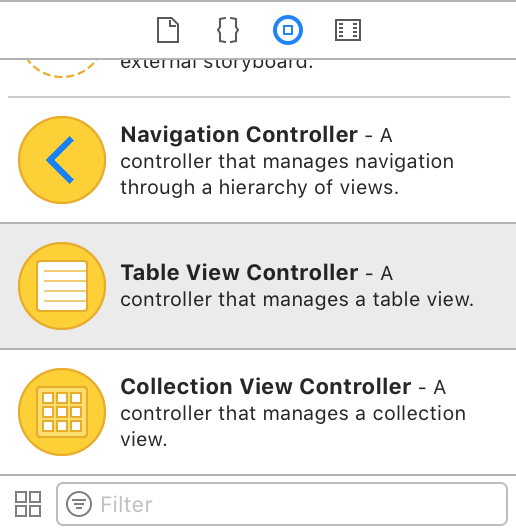

# Tutorial - iOS

Last updated **October 9th 2017**. Current **SensumKit** release: **0.2**.

## Getting Started

The **SensumKit** framework is developed on **Xcode 9** and we recommend using this version. iOS 9 targets and up are currently supported. Running apps usign **SensumKit** on the Simulator is not currently supported.

This tutorial takes you through creating a basic iOS application that demonstrates how to use the **SensumKit** framework in a Swift project.

If you encounter any issues or would like to provide feedback, please contact <a href = "kharron@sensum.co">Kelvin Harron via email</a>. 

## Requirements

* Xcode 9 or newer.
* iOS device running iOS 9 or higher. 
* SensumKit.framework version 0.2.
* Cocoapods installed. <a href = "https://guides.cocoapods.org/using/getting-started.html">https://guides.cocoapods.org/using/getting-started.html</a>

### Create a new project

* Create a new project in Xcode. In this example we are using a **Single View Applicaiton**.
* Choose an appropriate name and identifier. This example uses Swift as the language. 


#### <p style="text-align: center;">Figure 1 - Project Creation in Xcode</p>

* You will now have an overview of your Xcode project as shown in **Figure 2**. Close out of Xcode to prepare the installation of Cocoapods.


#### <p style="text-align: center;">Figure 2 - Overview of Xcode Environment</p>
<br>

## Installing Cococapods

### "Why do I need Cocoapods to use your framework"?

The **SensumKit** framework internally manages the upload of data collected to the **Sensum API**. By using the CryptoSwift and AWSCognito frameworks we are able to securely sign each upload request which ensures user data is handled securely on upload.

Google SignIn is used to the authentication of end users in your application. While the **SensumKit** framework does not dependent on its code, it is a dependency required by the front end of your application to permit end users to upload data to the **Sensum API**.

We specify the version numbers here to ensure full compatability with **SensumKit**. If you find any conflicts with the versions specified here, please contact us to help find a solution for your application.

* If you haven't used Cocoapods before, we recommend using the CocoaPods app that is available <a href = "https://cocoapods.org/app">here</a>. This example uses the app.
* Create a new podfile from the Xcode project. File > New Podfile from Xcode Project
* Add the following pods to your podfile:

> Code Snippet 1 - Cocoapods for the Podfile 

```shell
  # Pods for SensumKitTutorial
  pod 'Google/SignIn'
  pod 'CryptoSwift', '0.7.1'
  pod 'AWSCognito', '2.6.2'
  pod 'AWSCognitoIdentityProvider', '2.6.2'
``` 

* Click the install button to install the required CocoaPods.


#### <p style="text-align: center;">Figure 3 - Cocoapods app with the Cocoapods added </p>

* Allow a few moments for the pods to install. Google and AWS have further dependencies to function.


#### <p style="text-align: center;">Figure 4 - Cocoapods app with the Cocoapods installed </p>

* You are now ready to install the SensumKit.framework. 

## Installing the SensumKit framework

* Navigate to the directory where you first created the Xcode project.
* After installing the Cocoapods, you will find a **SensumKitTutorial.xcworkspace** file. **Ensure this is the project file you use from now on**. Open this file to launch Xcode.
* Select the Xcode project file, navigate to the *General* tab, scroll down the page to the *Embedded Binaries* section (highlighted in Figure 6)


#### <p style="text-align: center;">Figure 5 - Accessing Embedded Binaries within General tab of the Xcode project file</p>
<br>

* Locate the provided **SensumKit.framework** file included in the zip file you downloaded. 
* Drag the **SensumKit.framework** into the *Embedded Binaries* section of the Xcode project file, as shown in Figure 6. Alternatively you can use the + button to select it from its directory.
* A dialogue box will present you with options relating to adding the framework (Figure 9).  
Ensure **Copy items if needed** is selected, then press **Finish**.


#### <p style="text-align: center;">Figure 6 - Embedded Binaries import dialogue box</p>
<br>

* The successfully imported framework should then appear as displayed in Figure 7 below.


#### <p style="text-align: center;">Figure 7 - SensumKit.framework imported correctly</p>
<br>

* Ensure you connect an iOS device to your mac and from the device targets, select it to ensure the framework can expose its functions.


#### <p style="text-align: center;">Figure 8 - Choosing Device build target</p>
<br>

* Use ⌘B or select Product > Build to build the project, ensuring everything is in order.
* In order to make use of the **SensumKit**, add the code shown in Code Snippet 2 to your *ViewController* class. If any errors appear ensure all steps were followed correctly and you have selected an iOS device as your target.

> Code Snippet 2 - SensumKit import statement

```swift
import SensumKit
```

## Starting the SensumSDK
* To start the **SensumSDK** you will need:
    * an *API Key*,
    * a *host URL*,
    * a *stage URL*.

* We will provide you with the *API Key* as a string, all you have to do is pass this string into the *SensumSDKManager*.
* By default, the *host URL* and *stage URL* should be **emotionai.sensum.co** and **v0** respectively, unless we have instructed you otherwise.
* In order to create an instance of the *SensumSDKManager*, follow the example within Code Snippet 9.

<br>

> Code Snippet 3 - Starting the sensumSDK

```swift
import UIKit
import SensumKit

class ViewController: UIViewController {
	var sensumSDK: SensumSDKManager?

	override func viewDidLoad() {
           super.viewDidLoad()
           // Do any additional setup after loading the view, typically from a nib.
           sensumSDK = SensumSDKManager(
               requestEngineInternalInSeconds: 30,
               apiKey: "PublicDemoKeyForDocumentation",
               host: "emotionai.sensum.co",
               stage: "v0")
	    startEverythingUpdating()
       }

	func startEverythingUpdating() {
		sensumSDK?.accelerometer.startUpdating()
		sensumSDK?.location.startUpdating()
		sensumSDK?.bluetooth.startUpdating()
		sensumSDK?.unicodeTag.startUpdating()
	}
}
```

## Retrieving Accelerometer and Data from the SensumSDK

* Once you have started the **SensumSDK** as shown in the previous example, you can query for both location (GPS) and accelerometer (motion) data locally.

* **SensumKit** uses listener protocols to provide classes with a means to listen for and handle updates. To implement an accelerometer listener, first you must import *CoreMotion* at the top of your class:

> Code Snippet 4 - CoreMotion import statement

```swift
import CoreMotion
```

* Add an extension to your ViewController (shown below Code in Snippet 5) by implementing the **SensumSDK** Listener protocol for *AccelerometerListener*:

> Code Snippet 5 - SensumKit AccelerometerListener extension

```swift
extension ViewController: AccelerometerListener {
	func accelerationUpdated(newAcceleration: CMAcceleration, dateTime: Date) {
            print(newAcceleration)
    }
}
```

* Register the listener in your class (preferably in your `viewDidLoad()` method), referencing the **SensumSDK** variable you first created (see Code Snippet 6).

> Code Snippet 6 - Registering Accelerometer Listener

```swift
sensumSDK?.accelerometer.assignListener(self)
```

* You should now see the output as displayed in Figure 9. As a *CMAcceleration* object you can query the x, y and z values independently.


#### <p style="text-align: center;">Figure 9 - Example output from AccelerometerListener</p>
<br>


* To obtain location update from **SensumKit** you can follow the same approach. First import *CoreLocation* so you can handle the objects in your class.

> Code Snippet 7 - CoreLocation import statement

```swift
import CoreLocation
```

* Now extend your ViewController as below by implementing the **SensumSDK** Listener protocol for *LocationListener*:

> Code Snippet 8 - SensumKit LocationListener extension

```swift
extension ViewController: LocationListener {
    func locationUpdated(newLocation: CLLocation) {
        print(newLocation)
    }
}
```

* Register the listener in your class, (preferably in your `viewDidLoad()` method), implementing the **SensumSDK** Listener protocol for *LocationListener*:

> Code Snippet 9 - Registering Location Listener

```swift
sdkManager?.location.assignListener(self)
```

* Due to the nature of accessing location data of the user, you will be required to implement usage reasons in the app **Info.plist** to access CoreLocation data. 
* To quickly implement these usage permissions, find your **Info.plist** in the Project navigator and right click > Open As > Source Code. This will present the file in XML view.
* Paste the below snippet into the plist: 

> Code Snippet 10 - Adding usage descriptions for Location

```xml
<key>NSLocationWhenInUseUsageDescription</key>
<string>Track user location</string>
<key>NSLocationAlwaysAndWhenInUseUsageDescription</key>
<string>Track user location</string>
```

* You should now see the output as displayed in Figure 10. As a *CLLocation* object you can query the latitude, longitude, course, location, accuracy, time and speed values independently.


#### <p style="text-align: center;">Figure 10 - Example output from LocationListener</p>
<br>


## Scanning for BLE devices

**SensumKit** supports connecting to BLE devices for reading heart rate measurements. For a list of tested compatible devices please view the <a href = "http://help.sensum.co/knowledge_base/topics/what-type-of-sensors-can-i-use"> list of compatible devices</a> at our Knowledge Centre.

**Note:** This document is regularly updated with new devices. Please contact us for integration details. GSR data is only accessible from Shimmer devices at present which is not supported on iOS due to the device using an older bluetooth protocol not officially supported on iOS.

* To connect a BLE device through the **SensumSDK manager**, you may wish to introduce a tableView or list style UI element. 
In this example we use a *UITableViewController*.

* Go to File > New > File > Cocoa Touch Class. Set the name to BLE and set the subclass as *UITableViewController* to create a table view controller where we can create a list of bluetooth peripherals to display when scanning. See figure 11 below as an example:


#### <p style="text-align: center;">Figure 11 - Creating a TableViewController</p>
<br>

* First, navigate to your *Main.storyboard* file.
* Using the Object library drag a *Table View Controller* into the storyboard as shown below in Figure 12.

 
#### <p style="text-align: center;">Figure 12 - Selecting a TableViewController</p>
<br>


* Under the attributes inspector, ensure you tick the box for *Is Initial View Controller*.

 
#### <p style="text-align: center;">Figure 13 - Assigning Is Initial View Controller</p>
<br>

* Under the identity inspector, ensure you set the class to what we just created as *BLETableViewController*.

 
#### <p style="text-align: center;">Figure 14 - Setting class in Storyboard</p>
<br>

// TODO: CONTINUE FROM HERE

* Ensure your table datasource and delegate is set to your *ViewController* and implement the required functions. Ensure you have a tableView variable from your outlet in the class file.

* Next, import *CoreBluetooth* so you can manage the *CBPeripheral* type which is a parameter in the listener function (see Code Snippet 16). If you are working in a new class, don't forget to `import SensumKit`.

> Code Snippet 16

```swift
import CoreBluetooth
```

* Next, implement the *BluetoothListener* extension as shown in Code Snippet 17.

> Code Snippet 17

```swift
extension BluetoothTableViewController: BluetoothListener {

	public func deviceDiscovered() {
		DispatchQueue.main.async {
			self.tableView.reloadData()
		}
	}

	public func bpmUpdated(newBpm: Int, dateTime: Date) {}
	public func deviceConnectionSuccess() {}
	public func deviceConnectionFailure() {}
	public func deviceDisconnected(disconnectedPeripheral: CBPeripheral) {}
}
```

* Each time a device is discovered, call `reloadData()` on your tableView variable in the class (demonstrated in Code Snippet 17).
* Assign your **SensumSDK** listener as shown in Code Snippet 18.

> Code Snippet 18

```swift
sdkManager?.bluetooth.assignListener(self)
```

* You will not see updates fired from the **SensumSDK** until you call `sdkManager?.bluetooth.startScanForDevices()` which we have previously done in `viewDidAppear()` or `viewDidLoad()`, or alternatively, these can be set via a button press.
* For these updates to appear in the *UITableView•, you will need to customise two of its functions implemented as part of the *UITableView*,in addition to creating a custom class that inherits from the properties of *UITableViewCell*.
* Create a new Cocoa Touch Class, call it `BluetoothPeripheralTableViewCell` and ensure it inherits from *UITableViewCell*. Then use the contents of Code Snippet 19 to quickly launch a basic example that will simply display the name of the device.

> Code Snippet 19

```swift
import UIKit
import CoreBluetooth

class BluetoothPeripheralTableViewCell: UITableViewCell {

    var peripheral: CBPeripheral? {
        didSet {
            if let newValue = peripheral {
                self.textLabel?.text = newValue.name
            }
        }
    }

    override func awakeFromNib() {
        super.awakeFromNib()
        // Initialization code
    }

    override func setSelected(_ selected: Bool, animated: Bool) {
        super.setSelected(selected, animated: animated)
        // Configure the view for the selected state
    }
}
```

* Turning attention back to the *ViewController* where you implemented the **SensumSDK**. The `cellForRowAt` function from the tableView will define how the cells in the table are customised, demonstrated in Code Snippet 20.

> Code Snippet 20

```swift
func tableView(_ tableView: UITableView, cellForRowAt indexPath: IndexPath) -> UITableViewCell {
    // the identifier is what was set in your .storyboard in the attributes inspector
		let bleCell = self.tableView.dequeueReusableCell(withIdentifier: "bleCell", for: indexPath) as! BluetoothPeripheralTableViewCell
		if let dictValue = sdkManager?.bluetooth.getDeviceList()[indexPath.item]?["peripheral"] {
			let peripheralToAdd = dictValue as! CBPeripheral
			bleCell.peripheral = peripheralToAdd
		}
		return bleCell
	}
```

* Set your `numberOfRowsInSection` to match the example shown in Code Snippet 21.

> Code Snippet 21
```swift
func tableView(_ tableView: UITableView, numberOfRowsInSection section: Int) -> Int {
		return (sdkManager?.bluetooth.getDeviceList().count)!
	}
```

* You should now see a list of devices populating the tableView.

## Connecting to a BLE Device

* Following on from the previous section, to connect to a selected BLE device, pass the selected cell to ` sdkManager?.bluetooth.connectTo(peripheralDevice: blePeripheral!)`.
* This will initiate a connection and, depending on the device, should after a few seconds start generating heart rate values that are passed to *BluetoothListener* protocol functions you have implemented.
* We have currently included additional *NSLog* outputs internally to **SensumKit** to detail the connection process. Your console output within Xcode should appear as shown in Code Snippet 22.

> Code Snippet 22

```swift
Scanning for bluetooth devices
Connecting to device: MIO GLOBAL-LINK
Stopping device scan
Device connected.
Device Connected
Discovered service: Heart Rate
Discovered service: Battery
```

* You can update the `bpmUpdated()` function in your listener which will output the user's heart rate.


## Listening for Updates from the SensumAPI
* **SensumKit** handles the process of collecting both raw and contextual data from the device, before uploading to the **SensumAPI** without the user having to configure HTTP requests and responses.
* Before you can get updates from the **SensumAPI**, you must ensure that you  call recording on your contextual data.
* As an example, you must first call `sdkManager?.accelerometer.startRecording()` to initiate the collection of accelerometer data. After this, call `sdkManager?.accelerometer.startSendingToAPI()`.
* Depending on when you instantiated the **SensumSDK** and the time value you declared as the upload interval, data collected within the interval will be sent with the resulting response fired to all `APIListener` objects.
* This response is accessible from any class that implements `APIListener`.
* To gather all data and send all data, use the code contained within Code Snippet 23 after creating the Sensum SDK object.

> Code Snippet 23

```swift
 func startEverythingRecording() {
        sdkManager?.accelerometer.startRecording()
        sdkManager?.location.startRecording()
        sdkManager?.bluetooth.startRecording()
        sdkManager?.tag.startRecording()
        sdkManager?.accelerometer.startSendingToAPI()
        sdkManager?.location.startSendingToAPI()
        sdkManager?.bluetooth.startSendingToAPI()
        sdkManager?.tag.startSendingToAPI()
    }
```
* At the top of your class `import RealmSwift` to query the response data. We save parsed data from the **SensumAPI** to Realm so it can safely persist on the device.
* Next implement an extension at the end of your class of type `APIListener`, follow the example as shown in Code Snippet 24.
> Code Snippet 24

```swift
extension RecordingMasterViewController: APIListener {

    func realmResponseSaved() {
        // saved to Realm, lets query it and print the values
        if let realmResponse = try? Realm().objects(Response.self).last {
            print(realmResponse)
        }
    }

    func realmSentimentResponseSaved() {
        if let realmSentiment = try? Realm().objects(SentimentResponse.self).last {
            print(realmSentiment)
        }
    }

    func arousalReceived(arousalScore: Double) {
        print("arousalScore \(arousalScore)")
    }

    func apiRequestFailure(message: String, statusCode: Int?) {
        print("Failed to send to SensumAPI \(message) \(statusCode)")
    }

    func apiRequestSuccessful() {
        print("api request successful")
    }

}
```
* Don't forget to register the listener in the `viewDidLoad()` method using `sdkManager?.api.assignListener(self)`.  
* You are now ready to receive updates on any class that implements the listener extensions.
* We use Realm to safely and efficiently store/query data from the response the **SensumAPI** returns. <a href = "https://realm.io/docs/swift/latest/">We recommend you take some time to study the RealmDocs here</a>. The examples above will return the latest saved object from the **SensumAPI**.
* A Response object is the parent object saved from a request made to the **SensumAPI** with contextual sensor, accelerometer, and GPS data. The object is made up of the following components:
* Response:
    * `HeartRateResponse` - Processed Heart Rate data.
    * `AccelerometerResponse` - Processed Accelerometer data.
    * `LocationResponse` - Processed Location data.
* Each of the three sub-response objects are made up of *Stat* and *Event* objects. Feel free to examine the public Realm objects that we use to store data.
* `SentimentResponse` is a seperate object that represents processed emoji and text data. Code Snippet 25 illustrates how it should appear when printed from `sentimentResponseReceived()`:
> Code Snippet 25

```swift
Optional(SentimentResponse {
    textSentiment = Emotion {
        emotionality = 0;
        negativity = 0;
        positivity = 0;
    };
    emojiSentiment = Emotion {
        emotionality = 0.4236068641;
        negativity = 0.0936431989;
        positivity = 0.6575529733;
    };
})
```
* `ArousalResponse` is also a seperate object that represents processed heart rate data. Please see the <a href = "http://docs.sensum.co/#emotion-ai-api">**SensumAPI** documentation</a> for more information on processed data outputs.

## Third Party Authentication

* To authenticate your end users with access to the **SensumAPI** functions of **SensumKit**, you will need to use a third-party identity provider and implement the required Frameworks within your Xcode Project.

### Google:

* For Google, <a href = "https://developers.google.com/identity/sign-in/ios/start-integrating">follow these instructions to implement Google Sign-In within your Xcode Project</a>.
* Please note that you have already installed the required Google Frameworks using CocoaPods, so you will not be required to do so again.

 __**IMPORTANT**__ after creating your Configuration file, please ensure you contact us at:
 **bertha@sensum.co**, including your *CLIENT_ID* as selected below from the Configuration file generated by the Google Sign-In service (see Figure 37). The format of this ID is typically a combination of numbers and characters followed by *apps.googleusercontent.com*. Upon confirmation that the *CLIENT_ID* has been saved, you will be able to successfully authenticate users in your application.


#### <p style="text-align: center;">Figure 37 - Configuration File plist generated from Google Sign In guide.</p>
<br>

* While the *Google Sign-In* example showcases the implementation in the *AppDelegate.swift* file, in our example application we have used a *LoginViewController* class to implement the delegate methods.
* Where you call the `signIn` delegate function in your class, successfully signing a user in will result in a <a href = "https://developers.google.com/identity/sign-in/ios/api/interface_g_i_d_google_user">GIDGoogleUser object</a>.
* Pass the `idToken` generated by this object to the parameter `authenticationToken` of the **SensumKit** `federatedSignIn` function.
* This function will respond (via a callback) with the result of the authentication against the **SensumAPI** as successful/unsuccessful. See Code Snippet 26 for an example.

> Code Snippet 26

```swift
func sign(_ signIn: GIDSignIn!, didSignInFor user: GIDGoogleUser!, withError error: Error!) {
    if error != nil {
        print(error ?? "google sign in error")
    } else {
        signInStatusLabel.text = "Signed in with Google"
        sensumSDK?.authentication.federatedSignIn(provider: "accounts.google.com",    
            authenticationToken: user.authentication.idToken)
    }
}
```
